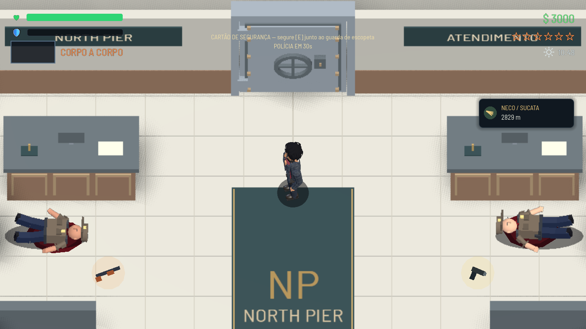
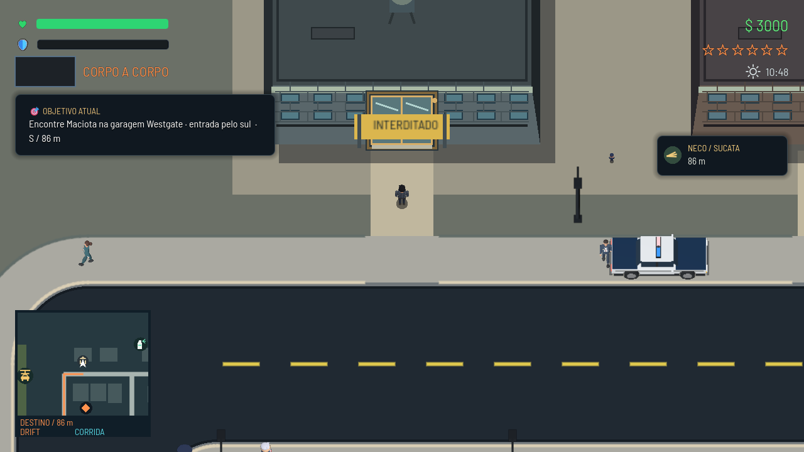

# Banco: queda no piso, evacuação e interdição

A queda dos guardas mantém a câmera 3D original, alinhada com a projeção do piso. O corpo deita lateralmente na circulação em frente ao balcão; a escala visual dos guardas foi reduzida em 10%. Não foi alterada uma captura: é o comportamento renderizado pelo jogo.

Os dois atendentes começam a evacuar quando o jogador aponta uma arma. A rota de fuga tem prioridade sobre desvios aleatórios de pânico, atravessa a saída, transfere os personagens para a rua na escala dos pedestres e continua pela calçada até eles irem embora. Apenas ameaçar não inicia a interdição; o assalto registrado pelo alarme inicia o evento.

## Ciclo do evento

1. Durante o assalto, a consequência fica pendente para permitir a fuga.
2. Quando o jogador sai, o banco recebe uma barreira física e a placa **INTERDITADO**. Tanto a passagem automática quanto a solicitação de entrada ao gerenciador respeitam a restrição.
3. Depois do cerco imediato, uma viatura e dois policiais vigiam a lateral por três dias de jogo. O estacionamento consulta colisões para evitar postes e veículos. Novos crimes num raio de 350 unidades mobilizam a dupla; passar pelo local não provoca uma abordagem. A reação usa o sistema existente de perseguição e abordagem.
4. Após três dias, termina a vigilância. Uma abordagem já iniciada continua. O banco fica fechado até completar quatro dias.
5. Na reabertura, saem a barreira e a placa; retornam os atendentes e os guardas, e o cofre fechado volta a conter $10.000 para um novo ciclo.

`CampaignState.bank_incident` guarda a fase e os dias decorridos no formato de save existente. O prazo usa tempo de jogo ativo dividido pela duração de dia configurada no gerenciador de ambiente (180 segundos por padrão), não dias reais nem tempo com o jogo fechado. Pausar interrompe a contagem. Restaurar o estado reconstrói a interdição e a vigilância sem duplicar a patrulha.

## Verificação

- `tests/test_bank_aftermath.gd`: 27 verificações, incluindo caminhada contra a barreira, evacuação real, projeção da queda, serialização/restauração do estado, reconstrução da patrulha, crime próximo/distante, pausa e limites dos dias. Datas aceleradas pelo relógio de teste.
- `tests/test_bank_heist_flow.gd`: 31 verificações do assalto, cartão, cofre, cerco e fuga; expectativa de reentrada atualizada para a interdição.
- `tests/test_bank_walkthrough.gd`: 38 verificações de passagens normais, reversões durante cooldown e porta do posto.
- Capturas inspecionadas com Vulkan Forward+; verificação de referências sem caminhos quebrados. As execuções registram avisos preexistentes do InputMap na inicialização e uma instância no encerramento.

