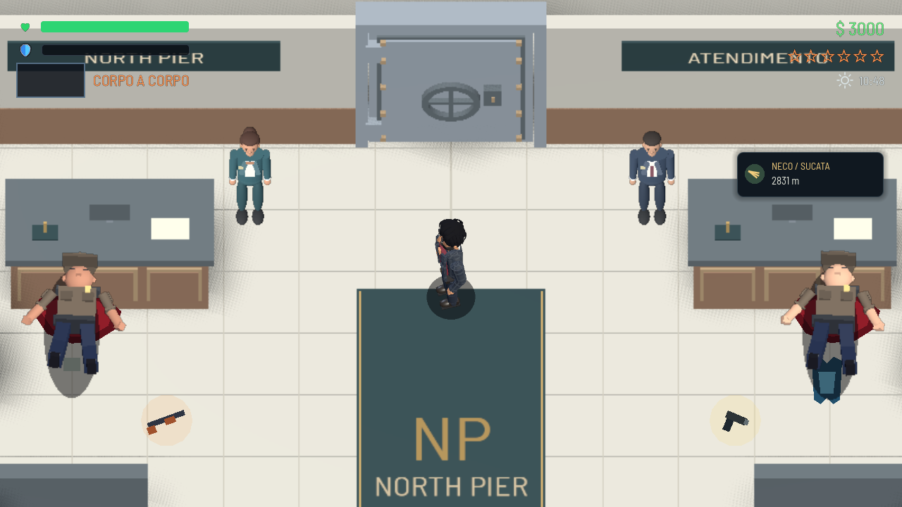

# Morte dos guardas do banco

- A arma some da mão no início da queda e aparece como item no chão, com uma breve animação desde a posição da mão.
- Cada guarda solta sua arma exatamente uma vez: escopeta com 8 cartuchos ou pistola com 12 munições. O drop fica separado do corpo e do cartão.
- Passar sobre o item não recolhe. A interação E permite escolher pegar; usa o inventário e a recompensa sonora existentes.
- Os olhos fecham em dois traços horizontais. Uma poça maior cresce sob o tronco, permanece no piso e desaparece gradualmente.
- As alterações são específicas dos guardas do banco. O componente compartilhado mantém o drop opcional de colete.

## Verificação

Godot 4.7.2 com Vulkan Forward+: `tests/test_bank_guard_death.gd` passou em 22 verificações na cena completa. Inclui arma na mão enquanto vivo, morte, dano repetido, olhos, poças, recusa/coleta por evento de interação, munição sem duplicação e o caminho alternativo de morte por atropelamento.

`tests/test_bank_heist_flow.gd` passou em 31 verificações, com captura redirecionada para esta revisão. Nenhum erro de script nas duas execuções finais; permanecem avisos preexistentes de InputMap na inicialização e uma instância no encerramento. O verificador de referências não encontrou caminhos quebrados.

