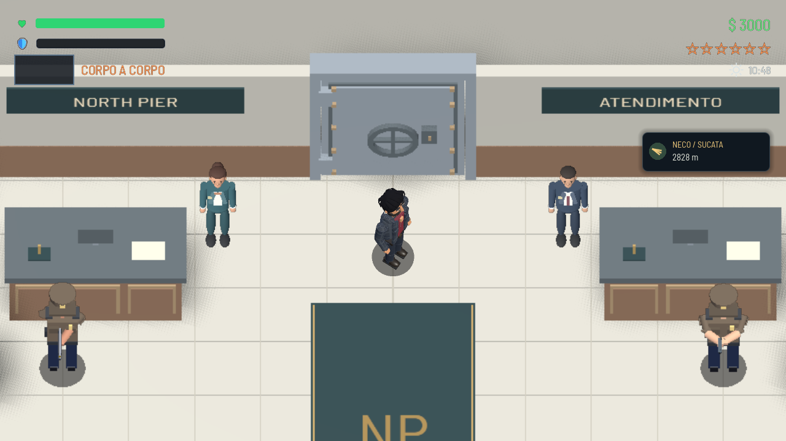
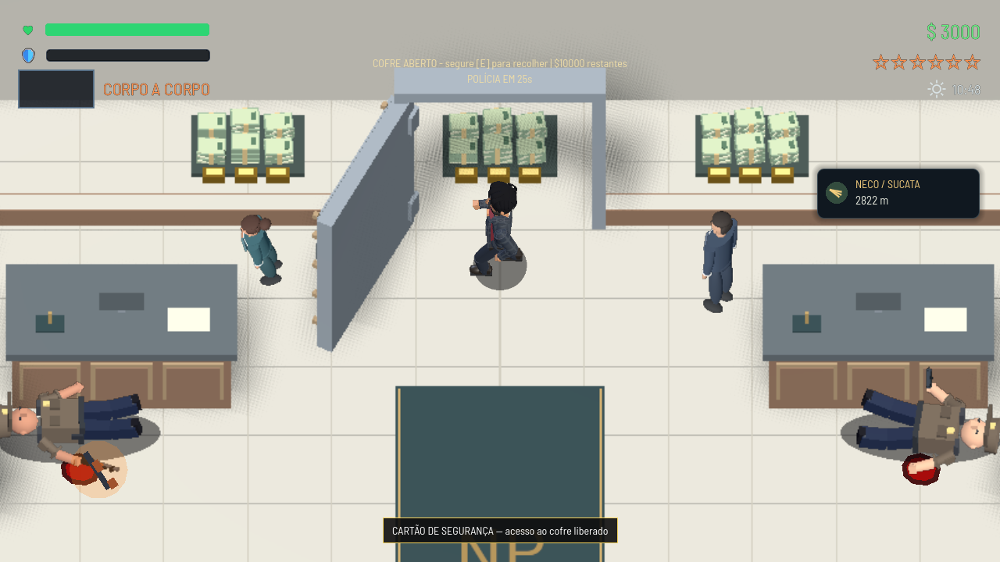

# Banco: atendentes, segurança e conteúdo do cofre

Os atendentes ficam nas laterais internas dos balcões, com pernas e sapatos completos. Foi removido o shader que descartava o corpo abaixo da cintura, junto das placas pequenas `01 / CAIXA` e `02 / CAIXA`.

O guarda da pistola tem uma pose própria com as duas mãos na empunhadura, cotovelos visíveis ao lado do colete e antebraços contínuos até os punhos. A pose compartilhada continua responsável por recuo, escopeta e recarga.

O cofre contém três conjuntos de maços de notas com cintas e barras de ouro. As recompensas são $4.000, $3.000 e $3.000, totalizando $10.000. Cada conjunto desaparece inteiro após segurar E por 1,2 segundo, usando os mesmos flags persistentes `bank_cash0/1/2`. Pilhas já coletadas em campanhas existentes continuam coletadas.

Ao destravar, a divisória recebe um corte visual baixo e suas placas deixam de encobrir o conteúdo. As colisões das laterais permanecem; o jogador precisa atravessar a porta aberta para recolher dinheiro. O status mostra o valor restante.

## Verificação

- Godot 4.7.2, Vulkan Forward+, RTX 4060 Laptop.
- `tests/test_bank_loot_presentation.gd`: 51 verificações aprovadas, incluindo caminhada real pela porta até a pilha lateral, advertência, combate, cartão, abertura, $10.000, prevenção de pagamento duplicado, cerco, fuga e reentrada.
- `tests/test_bank_fullscreen.gd`: 22 verificações aprovadas em 16:9, 4:3 e ultrawide. Capturas desta revisão foram direcionadas para a pasta abaixo.
- Nenhum erro de script nessas duas execuções. O carregamento ainda registra avisos preexistentes de bindings do InputMap e uma instância no encerramento.
- `python tools/check_references.py`: nenhuma referência quebrada.

