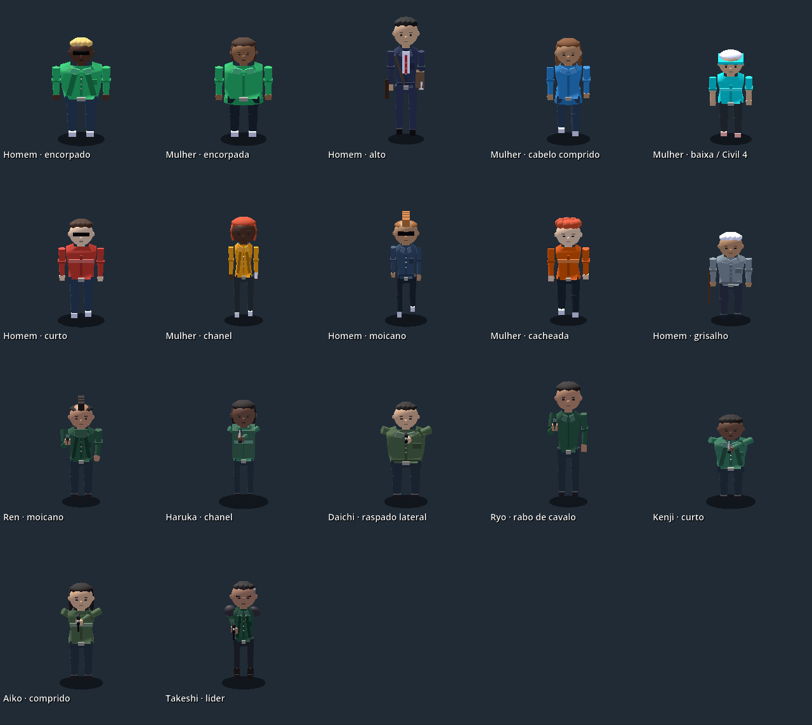
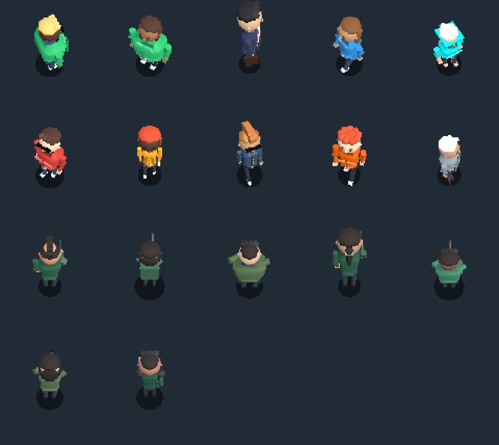

# Civis e identidade dos Cobras — 10/09/2026

Revisão a partir das capturas apontadas pelo usuário: o tronco arredondado exagerado foi substituído por uma malha com seções de ombro, cintura e quadril. O biotipo encorpado permanece mais largo, com volume integrado à roupa, sem uma segunda esfera de barriga. Um pescoço conectado à cabeça sobrepõe a gola e acompanha a animação, corrigindo a separação visível no civil baixo.

O elenco compartilhado de pedestres tem configuração de homem/mulher, oito cabelos e variações de rosto e roupa. A população `HarborWalker` alterna homens e mulheres e mantém uma identidade estável durante a criação sob demanda. Os cabelos incluem curto, franja lateral, chanel, rabo de cavalo, moicano, raspado lateral, comprido e cacheado. Chapéus de trabalho continuam associados ao traje; cortes explicitamente escolhidos não ficam escondidos por bonés aleatórios.

Os Cobras usam verde escuro, verde médio e oliva, inclusive o líder. Ren, Haruka, Daichi, Ryo, Kenji, Aiko, Sora, Akira e Takeshi dão identidade japonesa ao elenco fictício. Aparência e cabelo dependem do perfil do integrante, não da arma; dois papéis distintos não devem produzir acidentalmente o mesmo retrato. O comportamento de combate e os atributos não foram alterados.

## Verificação

- `test_civilian_identity.gd`: 85 verificações passaram com renderização Vulkan. Inclui dez civis, seis integrantes dos Cobras, líder, pescoço parado/em movimento, largura dos biotipos e instanciação real de oito `HarborWalker`, com quatro homens, quatro mulheres e pelo menos quatro cabelos distintos.
- `test_npc_shared_presentation.gd`: 233 verificações passaram, incluindo empunhadura e mão de apoio das armas em todos os biotipos.
- `test_body_proportions.gd`: passou com as expectativas revisadas de proporção natural e ausência da esfera de barriga.
- `test_cobra_boss.gd`: combate, duas tentativas e impactos de projéteis passaram. O encerramento desse teste ainda informa objetos/recursos retidos; isso não foi tratado nesta revisão visual.
- `test_cobra_territory.gd`: cinco estados, três guardas e dano real passaram, também com aviso de recursos retidos no encerramento.
- `test_presentation_budget.gd`: criação sob demanda, acessórios e incapacitação passaram.

As capturas aproximadas usam somente no teste um viewport maior. A captura de gameplay amplia o viewport normal de 96 px. Não há medição de desempenho nesta revisão.

