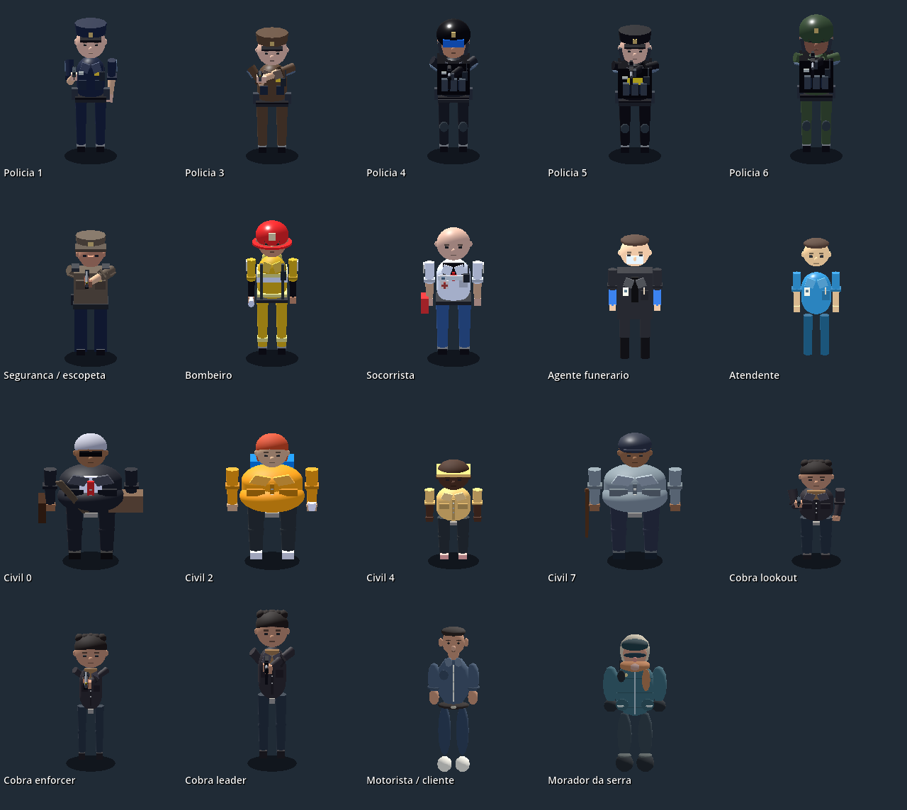
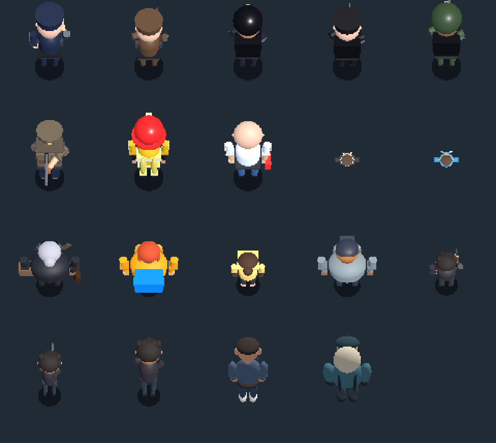
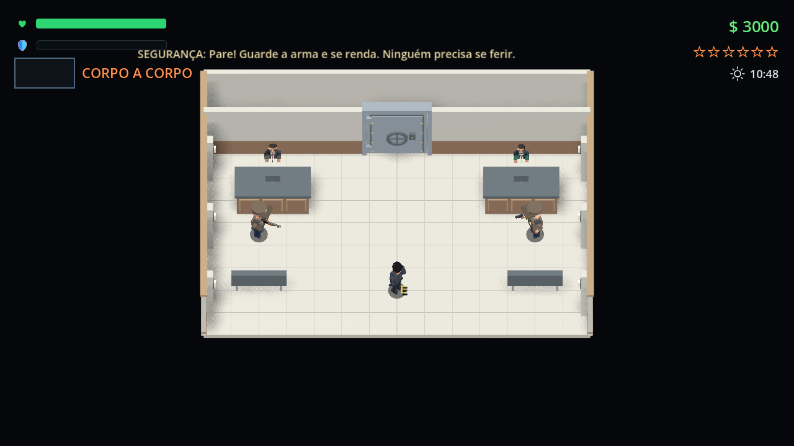
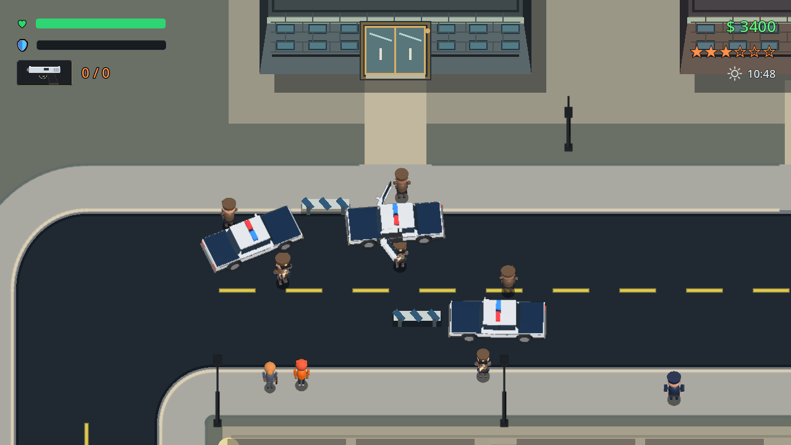

# NPCs, armas e poste do banco — 10/09/2026

Quepes agora têm copa fechada e arredondada acima do couro cabeludo. Capacetes táticos têm volume suficiente para cobrir a cabeça. Fardas receberam identificação, costuras, punhos, equipamento de cintura, bolsos, luvas e detalhes específicos por serviço. Pedestres, atendentes, agentes funerários, motoristas e moradores da serra receberam detalhes nos respectivos modelos compartilhados.

Polícia, segurança do banco, gangsters e Cobras usam `NPCCombatRig`, que chama diretamente `PlayerCombatPose` e `ArsenalWeapon3D`, os mesmos componentes de Dante: equipar, portar, mirar, correr, recuo, apoio da segunda mão e bombeamento da escopeta. Os perfis de todos os 13 tipos de arma estão disponíveis; a IA continua escolhendo suas armas e ataques existentes. Não foi criada uma animação de recarga separada: o componente atual de Dante não possui esse estado. Socorristas preservam as animações de trabalho. Queda/morte e incapacitação têm prioridade sobre as poses de combate.

A largura dos braços dos diferentes biotipos é aplicada às peças visuais, preservando a base dos ossos usada pelo solver das mãos. A criação sob demanda e o descarte de atualização fora da câmera continuam ativos.

O poste mudou de `(650,315)` para `(790,285)`, na lateral do banco, afastado também da trajetória de chegada das viaturas. A primeira posição lateral ainda sofria colisão durante o cerco; a posição final foi verificada com a chegada física das três viaturas, mantendo o poste em pé.

## Verificação

- `test_npc_shared_presentation.gd`: 233 verificações passaram com Vulkan/RTX 4060 Laptop. Cobertura dos cinco escalões policiais, segurança, serviços, civis, três papéis dos Cobras, todos os perfis de armas, empunhaduras, apoio nos cinco biotipos e prioridade da queda.
- `capture_npc_bank_presentation.gd`: 31 etapas do assalto e duas verificações adicionais do poste passaram com renderização real.
- `test_responder_routines.gd`: 22 verificações passaram, incluindo chegada, atendimento e reembarque de ambulância e bombeiros.
- `test_police_fair_arrest.gd`: passou.
- O teste de criação sob demanda foi atualizado para aguardar a animação de queda; a expectativa antiga exigia um corpo já deitado imediatamente após criar o modelo.

As capturas de detalhes usam câmeras próximas e viewports de 256 px somente no teste. `gameplay.png` amplia os viewports de produção de 96 px, sem aumentar a resolução do jogo. Não foi feita medição de desempenho nesta alteração. O teste completo do banco ainda emite um aviso de uma instância retida ao encerrar o processo.

