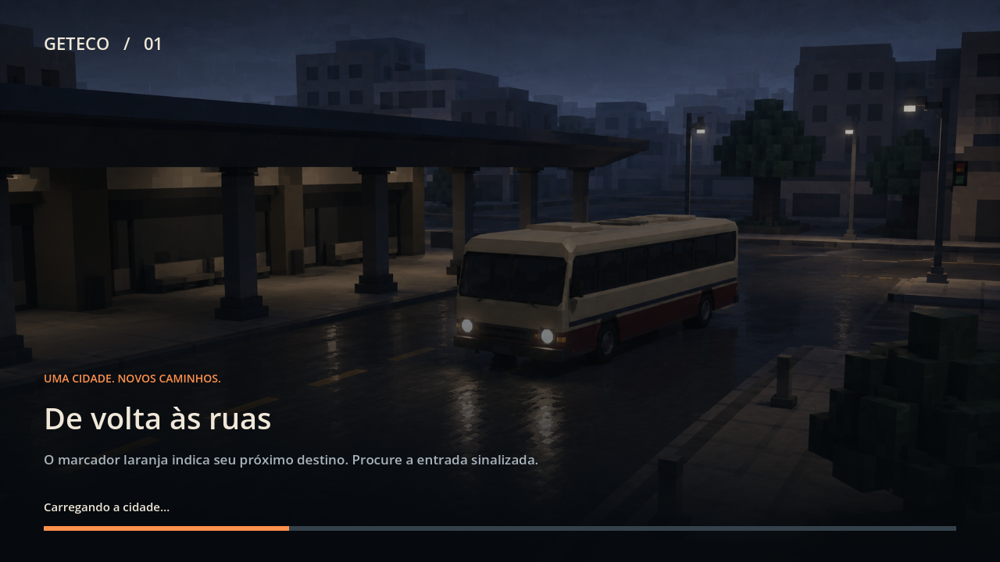
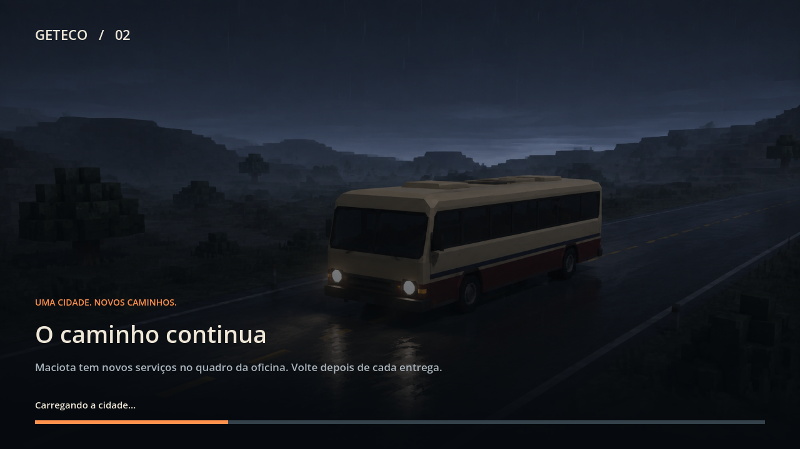
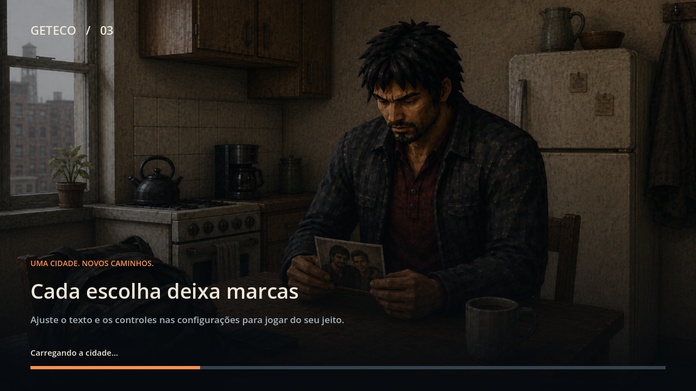

# UI/UX e entrada na partida — 10/09/2026

A interface recebeu uma linguagem compartilhada de superfícies escuras, texto marfim e foco laranja, preservando as cores funcionais de vida, armadura e alerta. A entrada principal passou a usar um carregador persistente com três composições baseadas nas artes existentes da abertura.

## Entrega

- Novo jogo, Carregar no menu, Carregar na pausa e Continuar passam pelo mesmo loading. A barra combina progresso de recursos com marcos de construção da cidade, restauração e apresentação; suaviza o avanço sem regredir. Há bloqueio contra início duplicado e retorno em caso de falha.
- A história aguarda a saída do loading. O quadro do Maciota é criado antes dessa espera, preservando as dependências da campanha.
- Sem saves, Novo jogo vem primeiro. Com save válido, Continuar usa o mais recente e apresenta etapa e data. Slots têm nomes legíveis e dinheiro sem zeros artificiais.
- Foco contido nos modais, ações ao fundo desabilitadas, Esc para fechar e restauração do foco. Vídeo com confirmação e reversão em 15 segundos; Cancelar restaura a fotografia de preferências feita ao abrir a tela.
- Remapeamento de teclado/mouse persistente, detecção de conflitos e ações de movimento separadas da navegação dos menus. Base de gamepad para movimento, mira, interação, armas e direção; dicas dos controles acompanham o dispositivo.
- Texto em 100%, 112,5% e 125%; redução de animações; opções para orientação no mapa e dicas contextuais. Traduções PT/EN das novas opções e revisão de mensagens técnicas.
- Destino ativo no minimapa, marcador na borda e orientação opcional por segmentos das ruas. A rota é uma ajuda geométrica: não modela mão de trânsito, obstáculos temporários ou acessibilidade de cada trajeto.
- Diário prioriza o objetivo atual e os serviços disponíveis; informa bloqueios/conclusões e mantém descanso opcional. HUD e mapa cedem espaço a diálogo e modais. Arsenal recebe cartões com ícones, munição e ação Equipar.
- Pilha do HUD da montanha acompanha a altura do objetivo. Perfil horizontal de toque, ativado em mobile ou com `--touch-ui`, com movimento, mira/disparo, interação e freio contextual. Mapa reposicionado e pausa fora da área de dinheiro.

## Loading





As imagens acima usam progresso fixado pelo teste exclusivamente para registrar as três composições. `04_loading_live.png` registra uma transição real. Os arquivos de arte originais não foram alterados.

O carregamento de recursos usa `ResourceLoader.load_threaded_request`; a criação dos nós ainda acontece na thread principal. Portanto, a barra pode ficar momentaneamente parada em etapas pesadas. A implementação não promete animação contínua durante cada construção síncrona nem redução do tempo total de entrada.

## Verificação

Godot 4.7.2, Windows, Vulkan/Forward+, RTX 4060 Laptop. Saves e configurações dos testes ficam em diretórios temporários próprios.

| Verificação | Resultado |
|---|---|
| `test_premium_ui.gd`, renderizado | 0 falhas: três fluxos de loading, retorno por erro, save/restauração, foco, cancelamento, confirmação de vídeo, rota, diário, ocultação do HUD e escala 125% |
| `test_premium_input.gd -- --touch-ui`, renderizado | 0 falhas: remapeamento real por eventos, remoção do atalho antigo, persistência, eventos de analógico, perfil de mapa e loading da cena legada |
| `test_menu_flow_integration.gd`, headless | 0 falhas: ciclo de menus, áudio, save e load; espera atualizada para o novo carregador |
| `test_language_settings.gd`, headless | 0 falhas |
| `test_opening_cutscene_runtime.gd`, headless | 0 falhas: abertura completa, pular, áudio e HUD |
| `test_legacy_save_route.gd`, headless | 0 falhas após correções de tipagem descritas abaixo |
| `test_pedestrian_life_routines.gd` e `test_pedestrian_render_lod.gd`, headless | 0 falhas funcionais; não são medições de desempenho |
| `profile_load_time_0909.gd`, renderizado | Auditorias de ruas e porto com 0 erros; 0 nós órfãos no monitor |
| `tools/check_references.py` | 0 referências quebradas novas |

Foram inspecionadas capturas em viewport real 1280×720, 1920×1080, 1600×1000 e 1920×810. Pausa e configurações a 125% cabem em 720p. A captura final do menu largo é `15_menu_ultrawide_final.png`; ela substitui a composição intermediária de `menu_1920x810.png`.

O script de revisão força alguns estados da campanha para abrir diário, quadro, diálogo e arsenal. Essas capturas validam composição, não uma campanha inteira. Eventos sintéticos de controle não substituem testes com gamepad físico. O perfil de toque foi renderizado no PC; ainda é necessário validar ergonomia, assistência de mira, suspensão/retomada e desempenho em aparelhos reais. Não foi validado 4K nem feito teste com jogadores novos.

Os logs finais não apresentam erros de script nos fluxos novos. Registram avisos de interpolação de câmera e instâncias residuais no encerramento (16 no fluxo principal; 25 no teste que também instancia o legado). A origem dessas instâncias não foi diagnosticada nesta entrega. O legado também registra lotes de cenário ignorados por sua auditoria de segurança.

## Trabalho compartilhado

O repositório já continha alterações de outras sessões. O commit desta entrega usa seleção parcial para preservar autoria e não absorver alterações de combate, personagens, áudio, lojas e cenário.

A verificação do legado encontrou duas falhas em funções de colecionáveis ainda não commitadas de `MissionManager.gd`: `String(int)` e inferência de `Variant` tratada como erro. As duas linhas foram corrigidas no workspace. Como as funções ainda não existem no HEAD, o ajuste foi preservado também em `legacy-local-typing.patch`, sem incluir o restante desse trabalho no commit de UI.

## Reprodução

Execute com o binário console do Godot e `--path .` na pasta `game`:

```text
--script res://tests/test_premium_ui.gd
--script res://tests/test_premium_input.gd -- --touch-ui
```

As capturas são gravadas nesta pasta. Os logs finais correspondentes acompanham este relatório. A aprovação visual e os testes realizados indicam avanço no acabamento, sem certificar o jogo inteiro como pronto para lançamento premium ou mobile.
