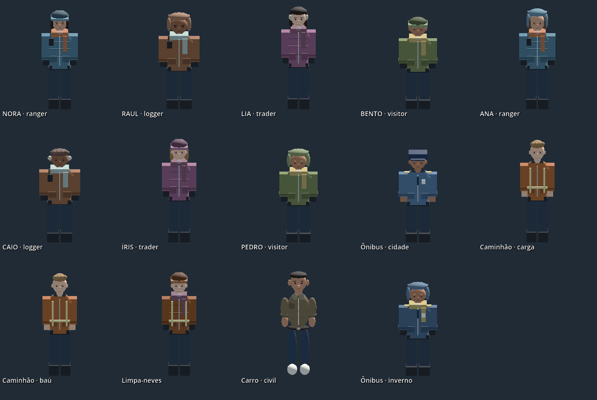
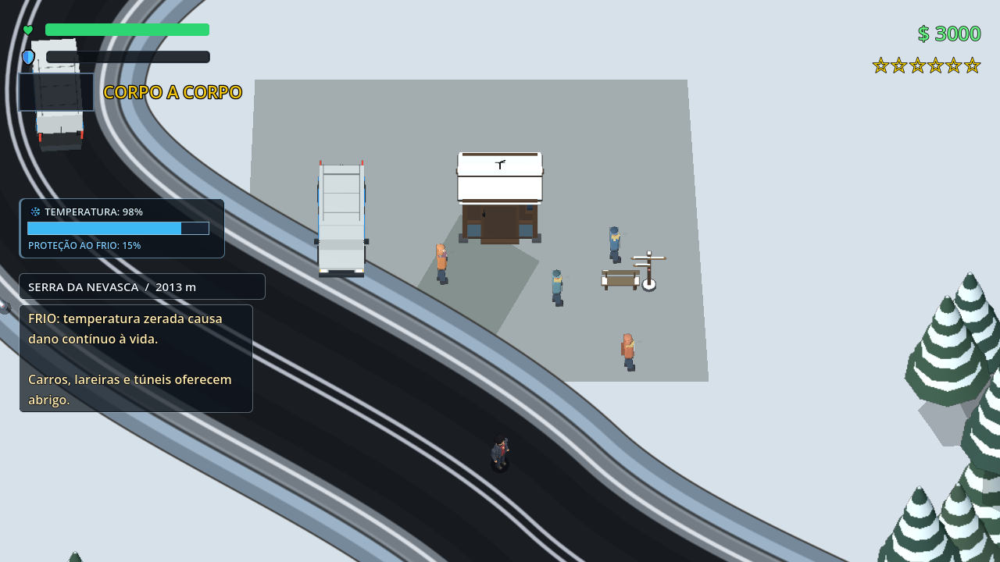

# População de inverno e motoristas — 10/09/2026

A serra passou de 15 para 25 moradores/viajantes, distribuídos pelo vale e pelos pontos de parada. As posições entram na mesma reserva de espaço usada pela floresta. Os dez novos percursos foram verificados fora da pista e os pontos de nascimento, fora de obstáculos. Moradores agora fazem pausas entre trajetos curtos e usam a navegação compartilhada para contornar obstáculos próximos.

O figurino de inverno combina homens e mulheres, proporções moderadas, tons de pele e cabelos, três coberturas de cabeça, cachecóis, casacos acolchoados, luvas, botas e acessórios por profissão. O modelo continua atualizando o viewport apenas por demanda e próximo do jogador. A luz ambiente permite reconhecer a roupa também quando o personagem vira de costas para a luz principal.

Motoristas ejetados de ônibus usam uniforme azul, identificação e detalhes nos ombros; motoristas de caminhão usam roupa de trabalho e faixas refletivas. Veículos de inverno ou ligados à região/rota da serra recebem a versão agasalhada. O perfil visual permanece associado ao veículo. Carros comuns e táxis preservam seus modelos existentes. Esta mudança configura o pedestre que sai do veículo; não adiciona uma cabine aberta nem um novo motorista visível através de vidros opacos.

Foi necessário adaptar `NPCCombatRig` aos novos métodos de consulta de recarga do componente de poses de Dante, que estava sendo atualizado no workspace. O adaptador consulta a recarga quando o ator oferece essa rotina; não inventa uma recarga na IA.

## Validação

- `test_winter_population_drivers.gd`: 78 verificações passaram com Vulkan. Instancia a região real, confirma 25 pessoas, homens/mulheres, variedade de cobertura, segurança dos dez novos pontos/percursos e uniformes efetivamente construídos na saída dos veículos, incluindo ônibus na serra.
- `test_mountain_life.gd`: 22 verificações passaram — clima, abrigo, 25 pessoas, animais, dano, cabana, coleta, salvamento e frota. O encerramento ainda informa recursos/objetos retidos; essa questão não foi tratada nesta revisão.
- `test_npc_shared_presentation.gd`: 233 verificações passaram após a compatibilidade com a consulta de recarga.

Não foi feita medição de desempenho. A comparação de roupas usa câmera próxima somente no teste; a captura do ponto de parada vem da região real.

